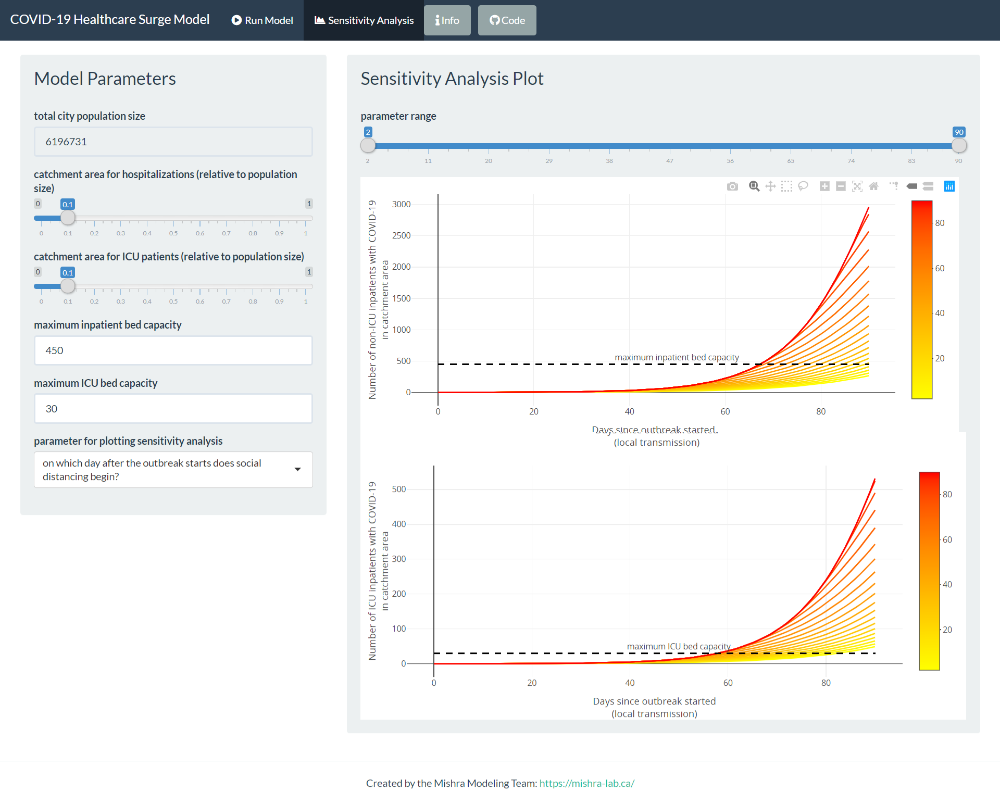

# COVID-19 Healthcare Surge Model for Greater Toronto Area Hospitals

# [Click here to visit the shiny application!](https://mishra-lab.shinyapps.io/covid-GTA-surge-planning/)

## Overview of the repository

| Folder | Description |
| ------ | ----------- |
| [`src/`](src/) | The main source code powering the [shiny application](https://mishra-lab.shinyapps.io/covid-GTA-surge-planning/). |
| [`paper/`](paper/) | Contains the full R code of the model, input data, figures and the main manuscript text. |
| [`reports/`](reports/) | Contains the latest PDF versions of our reports to Unity Health Toronto Infection Prevention and Control (IPAC). |
| [`data/`](data/) | Contains a timeseries (January 25 to June 7, 2020) of confirmed COVID-19 cases in the Greater Toronto Area, broken down by region. |

## Running the shiny application from source
1. Clone the repository and `cd` into the `src` directory.
2. Launch the R terminal with `R` and wait for `renv` to be installed.
3. Download the necessary packages by running `renv::restore()`. 
    **Warning: this may take a while!**
4. Once all the packages are installed, run `source('./scripts/run_shiny.R')`.
    This will open a browser window with the shiny application.
