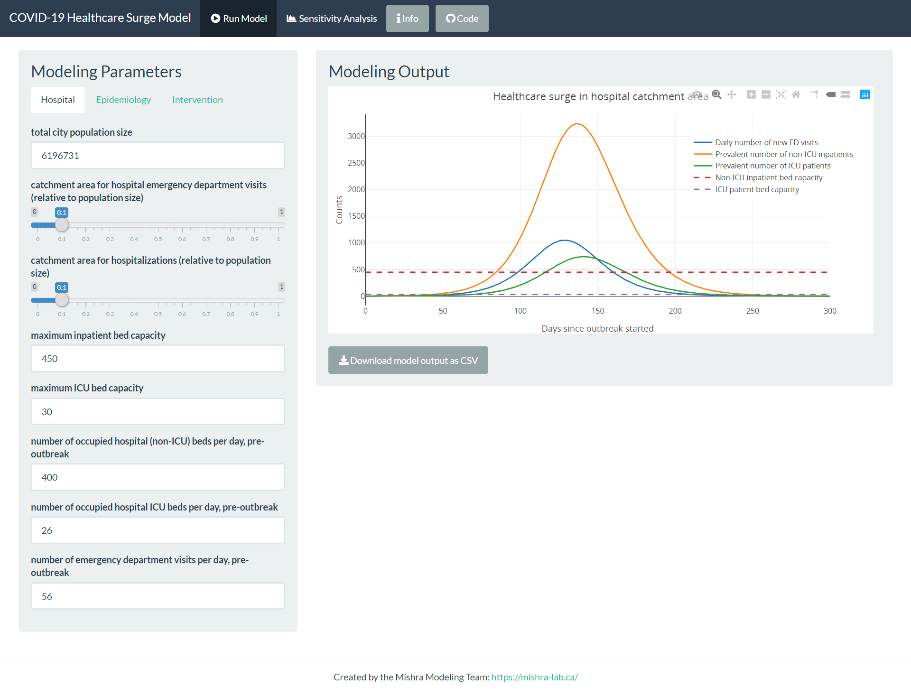

# COVID-19 Healthcare Surge Model for Greater Toronto Area Hospitals

# [Visit the shiny app!](https://mishra-lab.shinyapps.io/covid-GTA-surge-planning/)

## Running from source
1. Clone the repository and `cd` into the `src` directory.
2. Launch the R terminal with `R` and wait for `renv` to be installed.
3. Download the necessary packages by running `renv::restore()`. 
    **Warning: this may take a while!**
4. Once all the packages are installed, run `source('./scripts/run_shiny.R')`.
    This will open a browser window with the shiny application.